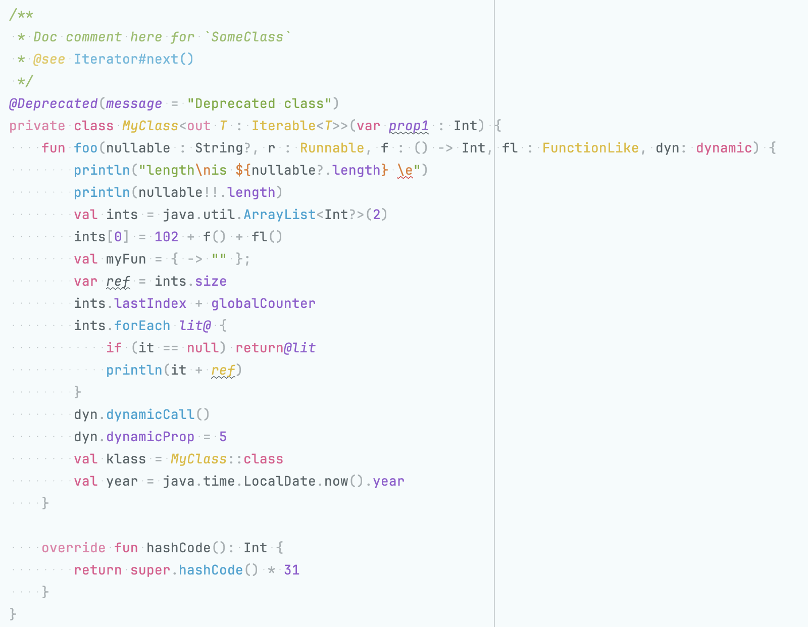
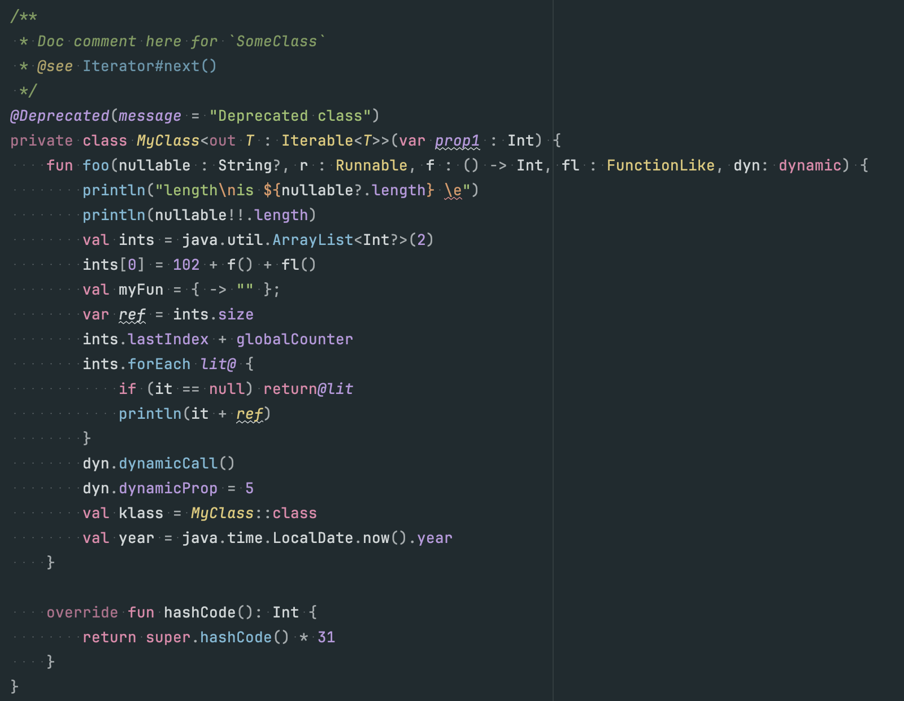
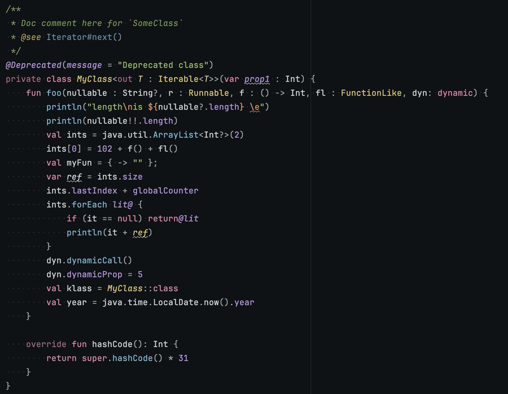

# Sakura Theme

**JetBrains Marketplace Statistics**

## Notice

I'm no longer using JetBrains products, so it is unlikely that I will be maintaining this theme from this point forward. Instead I will be building a [Neovim version](https://github.com/connorwyatt/sakura.nvim) of this theme which will be maintained.

<!-- Plugin description -->
_NOTE: This plugin is pre-release, there may be some parts of the UI which are not yet themed. Please add an issue if you
notice any unthemed parts of the UI, or any parts with bright reds, greens and cyans etc. as I have been using them to
find elements in the UI which are not documented well._

This plugin is a set of themes for IntelliJ based IDEs. It is inspired by sakura trees.

There are 4 variants (from lightest to darkest):

- Sakura Day
- Sakura Dusk
- Sakura Night
- Sakura Midnight

Each of these variants have a few sub-variant that saturates the colors, and in the case of the dark themes there is a sub-variant to desaturate the background.
<!-- Plugin description end -->

## Installation

- Using the IDE built-in plugin system:
  
  <kbd>Settings/Preferences</kbd> > <kbd>Plugins</kbd> > <kbd>Marketplace</kbd> > <kbd>Search for "sakura theme"</kbd> >
  <kbd>Install</kbd>
  
- Manually:

  Download the [latest release](https://github.com/connorwyatt/sakura-intellij-theme/releases/latest) and install it manually using
  <kbd>Settings/Preferences</kbd> > <kbd>Plugins</kbd> > <kbd>⚙️</kbd> > <kbd>Install plugin from disk...</kbd>

## Screenshots

### Sakura Day Theme

### Sakura Dusk Theme

### Sakura Night Theme

### Sakura Midnight Theme

---
Plugin based on the [IntelliJ Platform Plugin Template][template].

[template]: https://github.com/JetBrains/intellij-platform-plugin-template
[docs:plugin-description]: https://plugins.jetbrains.com/docs/intellij/plugin-user-experience.html#plugin-description-and-presentation
